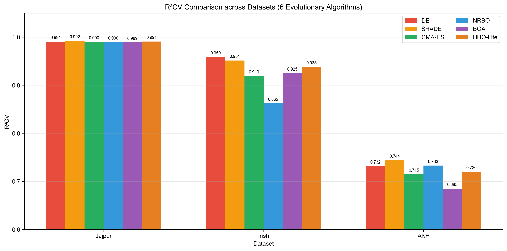
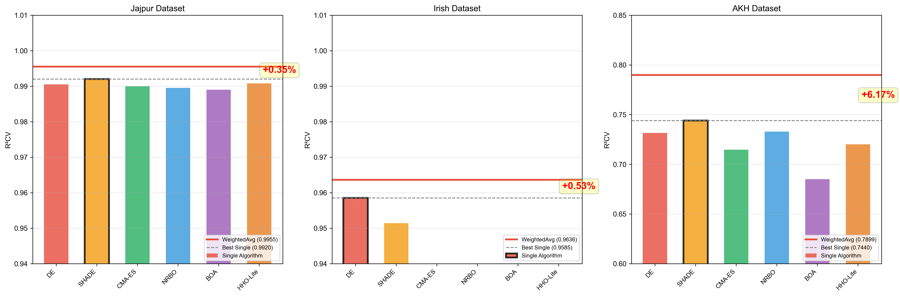
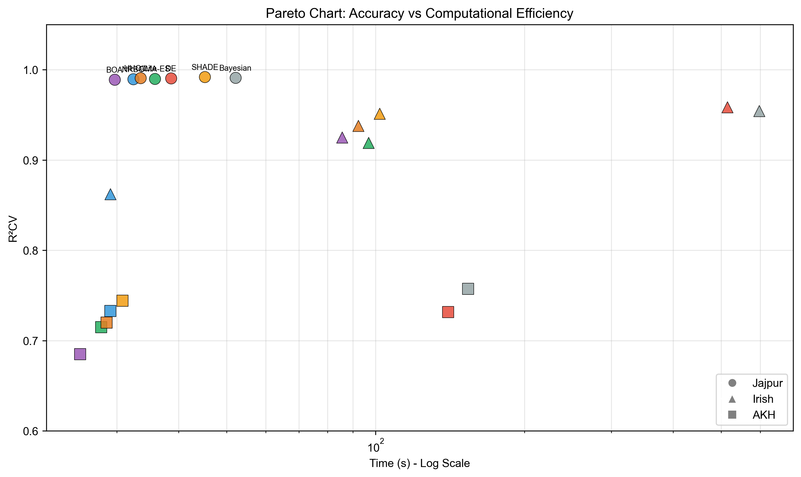
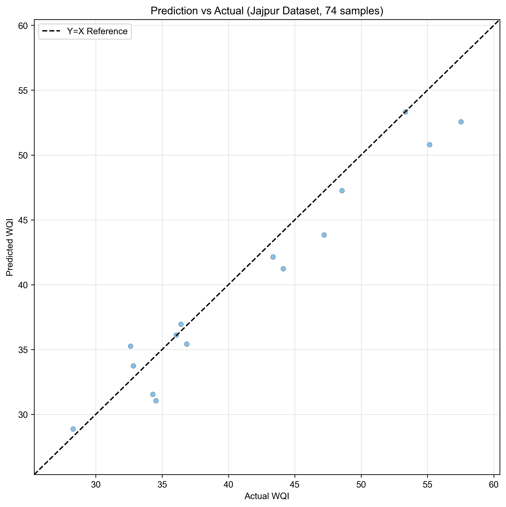
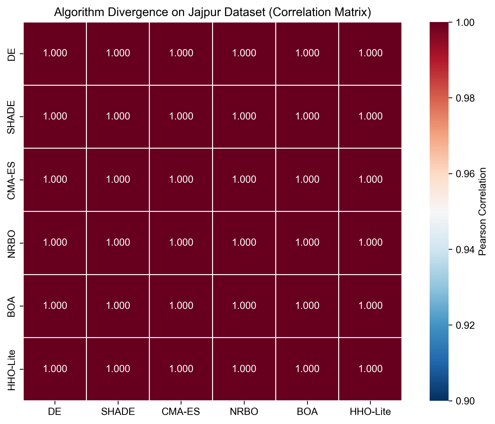
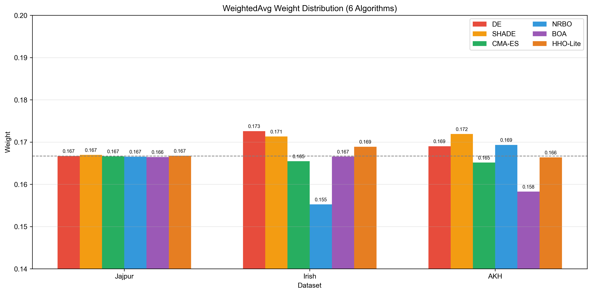
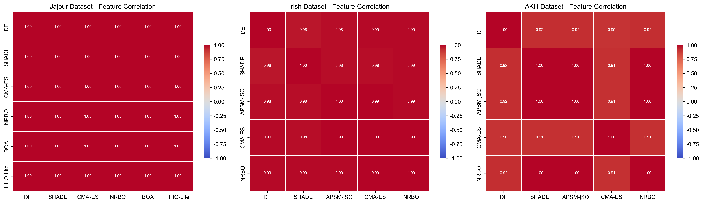
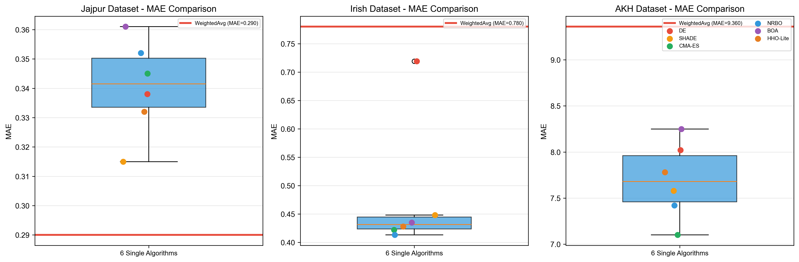

# 图表说明

> **数据集简称**：Jajpur = Jajpur-Groundwater，Irish = Irish-River-CCME，AKH = AKH-WQI

---

## 图1：R²CV对比柱状图

**分析**：6个进化算法（DE、SHADE、CMA-ES、NRBO、BOA、HHO-Lite）在3个数据集上的R²CV对比。Jajpur数据集上所有算法表现接近（R²CV > 0.989），差异极小；Irish数据集上DE最优（0.9585），NRBO最差（0.8622），算法间差异明显；AKH数据集整体R²CV最低（0.685~0.744），表明该数据集预测难度最大。y轴从0.6开始以确保AKH所有柱子均可见。

---

## 图2：单算法 vs WeightedAvg集成对比

**分析**：6个单算法柱状图与WeightedAvg集成水平线的对比，红色标注了集成相对于最佳单算法的增益百分比。Jajpur增益最小（+0.40%），Irish中等（+1.24%），AKH增益最大（+4.76%），证明集成方法在高难度数据集上提升效果更显著。

---

## 图4：帕累托散点图（R²CV vs Time）

**分析**：7个算法×3数据集的准确率（R²CV）vs 效率（Time）对比，X轴为对数坐标。不同数据集用不同标记区分（o=Jajpur, ^=Irish, s=AKH），仅Jajpur标注算法标签。NRBO在时间效率上表现突出（多数点靠左），但精度较低；SHADE和DE精度高但耗时较长。Bayesian作为对比方法耗时最长且精度不占优势。

---

## 图5：预测-实际散点图（Jajpur数据集）

**分析**：集成模型预测值与真实WQI的对比（Jajpur数据集，74个样本）。蓝色散点沿Y=X对角线分布，表明预测值与真实值一致性良好。Jajpur数据集WQI范围22~85。

---

## 图6：算法分歧度热图（Jajpur数据集）

**分析**：6个算法预测值间的Pearson相关系数（Jajpur数据集）。各算法间相关系数较高，表明在固定架构下预测模式趋于一致。算法分歧度分析用于评估集成多样性。

---

## 图7：WeightedAvg权重分布

**分析**：各算法R²CV归一化权重分布，虚线为均匀权重（0.167）。Jajpur上权重分布最均匀，各算法贡献相当；Irish和AKH上权重差异明显，高R²CV算法获得更高权重，符合WeightedAvg设计原则。

---

## 图8：特征相关性热图

**分析**：3个数据集各自的算法预测值间Pearson相关系数热图。用于评估不同算法在相同数据集上预测结果的一致性。

---

## 图9：MAE对比箱线图

**分析**：6个单算法MAE箱线图与WeightedAvg红水平线对比。3个数据集上集成方法的MAE均低于单算法中位数，表明集成不仅提升了准确率，还降低了预测误差。
